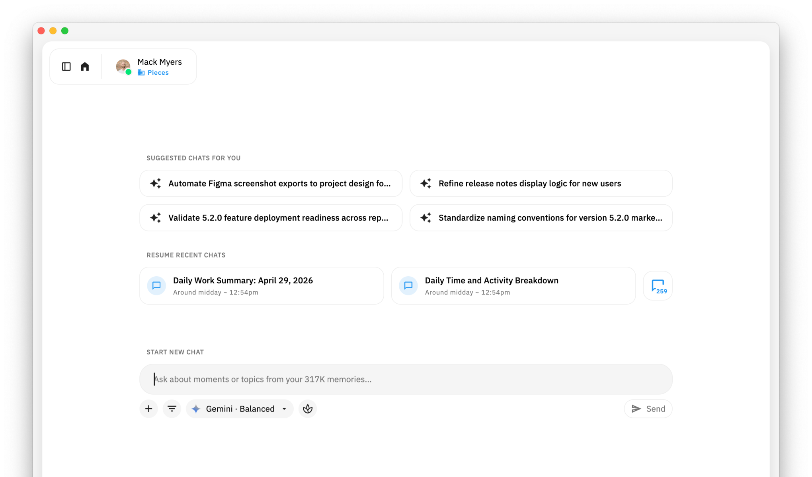
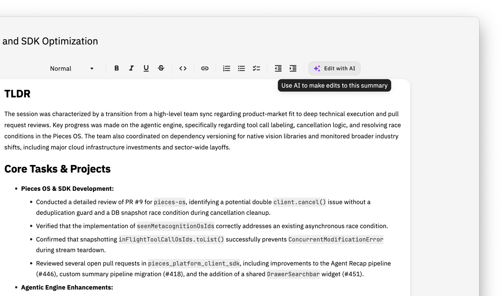
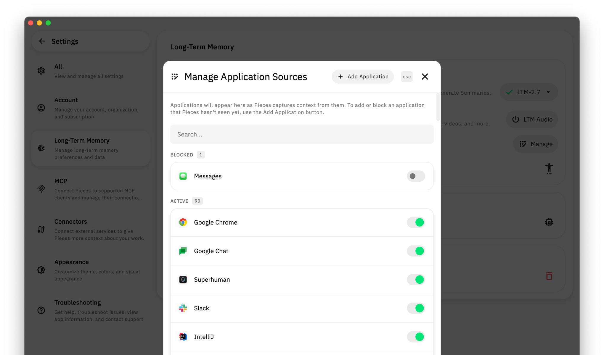

# What's New in Pieces 6.0.0

**Release Date:** May 2026
**Pieces Desktop:** 6.0.0

This is a big one.

Pieces 6.0.0 introduces **Agentic Long-Term Memory** — the biggest change to Pieces since we launched — powering a new generation of **Agentic Chats** and **Agentic Summaries**. Instead of single-shot Q&A, the agent now reasons across your artificial memory in multiple turns: following threads, cross-referencing context, and building toward complete answers instead of best-guessing them.

On top of that foundation, we're shipping the first summary that **takes action on your behalf**. Meeting Prep connects to your Google Calendar, looks ahead at what's coming, cross-references it with your Long-Term Memories, and pulls together everything you need to walk in ready — and can even put prep time on your calendar for you.

The rest of the release is about giving you more control and clearer signal: edit any Workstream Summary inline with AI, see the exact token usage behind every conversation, manage your LTM data at a granular level, set up the Pieces MCP Server in any editor with a single click, and discover and switch between AI models from a redesigned inventory built right into chat.

Here's what's new.

---

## ⚡ Agentic LTM: Powering Agentic Chats & Agentic Summaries

<video src="https://github.com/user-attachments/assets/68277699-0463-4912-9393-67e614bc28ed" controls="controls" autoplay muted style="max-width: 730px">
Agentic LTM
</video>

*The agent reasons across multiple turns — following threads, cross-referencing context, and building complete answers from your memory.*

**This is the biggest change to Pieces since we launched.**

**Agentic Long-Term Memory** fundamentally reimagines how Pieces interacts with your artificial memory, enabling both **Agentic Chats** and **Agentic Summaries**. Where prior versions answered a single question with a single look at your memory, the agent now operates across **multiple turns** — pursuing a question step by step, pulling new context as it discovers what's relevant, and building on previous responses instead of trying to one-shot everything.

The result is dramatically more accurate and complete answers, especially on the kinds of questions where the truth is spread across your day, your projects, and the people you work with.

### What's New

**Multi-Turn Reasoning Across Your Memory**
- The agent follows threads instead of guessing in one shot — when an initial fetch from your LTM leaves a gap, it recognizes the gap and goes back for more
- Cross-references context from across summaries, conversations, events, and people
- Builds on prior turns within the same conversation so follow-ups feel like a real dialogue

**A Full Toolbox for the Agent**

The agent now has access to a rich set of tools it can call autonomously during any chat or summary:

- **Memory Search** — multi-dimensional retrieval across your summaries, events, people, hints, and sources
- **Web Search** — real-time web research powered by Perplexity, with citations
- **Google Calendar** — read, create, update, and delete calendar events
- **Local Filesystem** — search file paths, grep file contents, and read files from your machine
- **Browser History** — look up browsing history, bookmarks, and recent activity across your browsers
- **User Persona** — your Pieces-generated profile that gives the agent context about who you are and the types of things you work on
- **Time Computation** — parse and calculate time ranges for temporal reasoning

These tools are what make Agentic Chats and Agentic Summaries meaningfully different from what came before — the agent doesn't just answer from memory, it actively gathers evidence from across your workstream and beyond.

**A Leaner, Faster, More Reliable Foundation**
- We've reduced layers in the architecture significantly — fewer hops between your question and the answer means faster, more deterministic results
- Both chats and summary generation are noticeably more reliable and stable, with less variance between runs
- The streamlined architecture also makes everything faster — responses come back quicker and summaries generate in less time
- The same foundation powers Agentic Chats and **Agentic Summaries** — every reliability and speed improvement compounds across the product

### Why It Matters

The shift from "answer the question" to "reason about the question" is what unlocks the next class of things Pieces can do for you — like Meeting Prep, Reflection Mode, and the agentic features we'll be shipping next. Whether you're asking a quick question or generating a Day Recap, the agentic foundation underneath is now built for the level of depth you've been asking for.

---

## 🪷 Reflection Mode: Metacognition for the Agent

<video src="https://github.com/user-attachments/assets/69ea43fa-5137-4e3c-9e2d-f18b1b67fd7b" controls="controls" autoplay muted style="max-width: 730px">
Reflection Mode
</video>

*Flip on Reflection Mode and the agent self-corrects in real time — deeper reasoning, better answers, even from leaner models.*

Reflection Mode is a new toggle that gives the agent **metacognition** — the ability to reflect on its own reasoning and self-correct in real time.

Instead of charging straight from prompt to answer, the agent steps back at key moments to evaluate what it's doing, question its own assumptions, and adjust course if it's drifting. The result is **harder work, better responses, and more useful answers — even from leaner models** that wouldn't normally hold up under that kind of pressure.

Reflection Mode works across short, medium, and long-term queries — anything from a quick factual lookup to a deep retrospective across months of work.

### When to Use It

Reflection Mode simply makes the model work harder. If you're seeing responses that feel shallow, incomplete, or off-target without it, try flipping Reflection Mode on — you should see noticeably better results. It's especially useful when you want the agent to slow down, think through a problem more carefully, and double-check itself — without forcing you onto a heavier model.

---

## 🧩 Redesigned Model Selection & Management

<video src="https://github.com/user-attachments/assets/a90a18ca-d038-4972-834c-d7d00adc539c" controls="controls" autoplay muted style="max-width: 730px">
Model Picker Updates
</video>

*Browse, compare, and switch models right from chat — no Settings detour required.*

We've completely redesigned how you discover, enable, and switch between AI models in Pieces.

The new **model inventory** replaces the old settings-driven approach with a cleaner, more intuitive selection experience right inside chat. Browse what's available, see what's enabled, and switch on the fly — all from where you're already working.

### What's New

**A Smarter In-Chat Picker**
- Browse and switch between models from inside chat, not buried in Settings
- Inline descriptions and capabilities help you pick the right model for the task at hand
- Recent and downloaded models surface where you'd expect them

**Built on the New Agentic Foundation**
- Backed by a unified model inventory across cloud, local, BYOK, and enterprise deployments
- The same picker works for everything — OpenAI, Anthropic, Google, AWS Bedrock, Azure, OpenRouter, on-device models, and more

### Why It Matters

The number of models worth using has exploded over the last year. The old "open Settings → scroll → flip three toggles" flow couldn't keep up. The new inventory makes choosing a model feel like choosing a font — fast, contextual, and out of your way.

---

## 📆 Google Calendar Integration

<video src="https://github.com/user-attachments/assets/941f52d4-2fa2-4352-b383-2bb786b4d44d" controls="controls" autoplay muted style="max-width: 730px">
Google Calendar Integration
</video>

*Connect your calendar in one click and your summaries instantly get richer, more accurate context.*

Pieces now connects directly to your Google Calendar — and it meaningfully changes how your summaries and the agent understand your day.

Your calendar is one of the **noisiest visual environments** on your screen — overlapping events, color-coded blocks, half-truncated titles, declined-but-still-visible meetings — and that noise has occasionally tripped up vision-based memory formation when interpreting what's actually on your day. Connecting directly to Google Calendar solves that: instead of inferring your schedule from a chaotic visual, Pieces reads it straight from the source.

When connected, calendar events flow into Morning Briefs, Standup Updates, Day Recaps, and more, so your summaries reflect what was actually scheduled — not just what happened to be on your screen. This is also the connector that powers Meeting Prep.

### What's New

- One-click connection to Google Calendar from **Settings → Connectors**
- Calendar events become first-class context in your single-click summaries
- Foundation for Meeting Prep and future calendar-aware features

### Why It Matters

A huge chunk of what your day actually *is* lives on your calendar — meetings, focus blocks, customer calls, 1:1s. Bringing that signal into Pieces makes everything from Morning Brief to Day Recap noticeably more accurate, and unlocks the action-oriented summaries we're building next.

### How to Use

1. **Open Settings** — navigate to Connectors
2. **Connect Google Calendar** — one-click setup
3. **Generate a summary** — calendar events will automatically appear in Morning Briefs, Day Recaps, and more

---

## 📅 Meeting Prep: AI That Actually Takes Action

<video src="https://github.com/user-attachments/assets/f3abc832-e7e6-4494-ac28-612e1b8f1b4b" controls="controls" autoplay muted style="max-width: 730px">
Meeting Prep
</video>

*One click to a structured pre-read — who's attending, what you've discussed, and what to walk in knowing.*

Meeting Prep is a brand-new single-click summary — and **the first one that takes action on your behalf**.

When connected to Google Calendar, Meeting Prep looks ahead at your upcoming meetings, cross-references each event with your Long-Term Memories, and generates a structured preparation plan: who's attending, what you've discussed before, what artifacts and decisions are relevant, and what you should walk in already knowing. With your permission, it can even **create prep events on your calendar** so the work to get ready is actually scheduled — not floating in your head.

### What's New

**Calendar-Aware Prep, in One Click**
- Pulls upcoming events directly from your connected Google Calendar
- Cross-references each meeting with related summaries, chats, files, and people from your LTM
- Generates a clean, structured pre-read for each meeting — not just a raw context dump

**Action, Not Just Answers**
- Can drop dedicated prep events onto your calendar so the time to get ready actually exists
- Surfaces follow-ups from prior meetings on the same topic or with the same people
- Highlights the artifacts (docs, code, threads) most likely to come up

### Use Cases

**Walk Into Renewals Already Grounded**
- One click before a customer call → a prep brief on the last 90 days of activity, open issues, and the last decision you made together

**Show Up to Standups Ready**
- Standup at 9:30? At 9:00, generate a prep covering yesterday's PRs, threads, and unresolved blockers

**Make 1:1s Actually Productive**
- Pull a prep before any 1:1 — Pieces surfaces topics you've been meaning to follow up on, decisions in progress, and recent work the other person has touched

This is the beginning of Pieces moving from *answering questions about your work* to *actively helping you do it*.

### How to Use

1. **Connect Google Calendar** — head to Settings → Connectors if you haven't already
2. **Find Meeting Prep** — it's in your single-click summaries on the home dashboard
3. **Tap to generate** — Pieces looks at your upcoming meetings and builds a structured prep
4. **Optionally schedule prep time** — let Pieces put prep events on your calendar

---

## 💬 A Refreshed Chat Empty State with Recent Chats Front and Center

We've refreshed the chat empty state — the screen you see when you start a new chat — to put your **recent conversations front and center**.

Pick up an open thread, jump back into the question you were working on five minutes ago, or kick off a fresh chat with the right context already in view. It's a small change that makes getting back into your flow significantly faster, especially when you're juggling multiple threads at once.

---

## ⏭️ Queue Up Your Next Message While the Agent Is Responding

<video src="https://github.com/user-attachments/assets/c85d5aea-d62e-4057-9fa6-88a4c0c93667" controls="controls" autoplay muted style="max-width: 730px">
Queued Messages
</video>

*Type your next thought while the agent is working — it picks up right where you left off.*

Don't wait on the agent to finish — **line up your next thought right now**.

While the agent is generating a response, you can type and queue up the next message to send the moment the current turn wraps up. No more sitting on your hands waiting for the agent to finish working through a long, multi-step task before you can react.

Changed your mind mid-response? Hit the send button on a queued message to **stop the in-flight response and immediately send the new one instead**. It's a faster, more conversational way to steer the agent — especially during deeper Agentic Chats where Pieces is doing real work between turns.

---

## 📊 See Token Usage per Conversation

<video src="https://github.com/user-attachments/assets/1e5cf919-fe1e-4338-8102-9c90fdaf3dc2" controls="controls" autoplay muted style="max-width: 730px">
Chat Token Usage
</video>

*See exactly how many tokens each conversation burns — input, output, reasoning, and cache all broken out.*

Ever wonder how many tokens a conversation has actually burned through? Now you can see it — per conversation, in real time.

Each chat tracks cumulative token usage broken down by **input, output, reasoning, and cache**. **LLM calls and tool calls are both counted**, so you see the true footprint of agentic work — not just the surface chat tokens.

### Why it matters

- **For teams managing API usage** — know which conversations and patterns are actually moving the needle
- **For BYOK and enterprise deployments** — get clean per-conversation visibility into your own provider's usage
- **For everyone** — make informed choices about when to reach for a heavy reasoning model vs. a leaner, faster one

It's the visibility layer the agentic era needs.

---

## ✨ Edit Summaries with AI — Inline Suggestions & Clean Diff Review

Your Workstream Summaries just got a powerful upgrade — you can now **edit them with AI, right inline**.

Select any text in a summary and tap "Edit with AI" to get suggested changes presented in a clean diff view. Accept, reject, or refine — all without leaving the summary editor. Want to overhaul the whole thing? You can also ask AI to rework the entire summary with a single prompt.

### What's New

**Inline Edits with Diff Review**
- Highlight any range of text → "Edit with AI" → see the suggested change as a side-by-side diff
- Accept, reject, or push back on the suggestion right in place
- Keep the parts you love, change only what you don't

**Whole-Summary Rewrites**
- Ask AI to rework the full summary with one prompt — "make this shorter for Slack," "rewrite this for an exec audience," "convert this into a checklist"
- All grounded in the original underlying memories, so nothing's invented

### Use Cases

**Polish Before You Share**
- Run a quick "tighten this up and make it Slack-ready" pass before pasting an End of Day Recap into your team channel

**Adjust Tone for the Audience**
- Same captured workflow, totally different framing for a customer recap vs. an internal standup

**Surgically Refine One Section**
- Love the TL;DR but want to expand the "decisions" section? Highlight just that part and ask for more depth — the rest stays untouched

### How to Use

1. **Open any Workstream Summary** — from the Timeline or Home Base
2. **Highlight text** — select the section you want to refine
3. **Tap "Edit with AI"** — review the suggested changes in a diff view
4. **Accept or reject** — keep what you like, push back on the rest

Your summaries, polished your way ✨

---

## 🔐 Granular Control Over Your Long-Term Memory Data

<video src="https://github.com/user-attachments/assets/ab94185f-80bc-44c8-80a8-ba6f2700ca65" controls="controls" autoplay muted style="max-width: 730px">
Clear LTM Data
</video>

*Surgically clear your memory by time range, modality, or app — full control over what Pieces captures.*

You now have **full, granular control** over the data Pieces captures in your Long-Term Memory.

Clear data by specific time periods — the last hour, today, this week, or a custom range. Filter by *how* it was captured: vision (screenshots), clipboard, or audio. And scope deletions to specific application sources, so you can wipe everything from one app while leaving the rest of your memory intact.

### What's New

- **Time-based scoping** — clear last hour / today / this week / custom range
- **Modality-based scoping** — vision, clipboard, or audio
- **App-based scoping** — wipe data from a specific application while leaving everything else alone
- **Combine all three** — surgically clear, e.g., "everything captured by vision from Slack today"

### How to Use

1. **Open Settings** — navigate to Long-Term Memory → Manage Data
2. **Choose a time range** — last hour, today, this week, or custom
3. **Filter by modality** — vision, clipboard, or audio (optional)
4. **Scope to an application** — select a specific app (optional)
5. **Confirm** — review and confirm the deletion

This gives you confidence in exactly what data Pieces has, and the power to manage it on your terms.

---

## 🚫 Proactively Block Apps from Long-Term Memory

You can now **proactively add applications to the LTM deny list** — even before Pieces has come into contact with them.

Previously, you could only block apps that Pieces had already captured context from. Now you can preemptively block any app on your system, so Pieces never captures data from it in the first place.

This is especially useful for applications that handle sensitive information — password managers, banking apps, healthcare and HR portals, anything you don't want represented in your artificial memory. Head to **Settings → Long-Term Memory → Application Sources** to manage your deny list.

---

## 🔌 One-Click MCP Setup from Desktop App Settings

<video src="https://github.com/user-attachments/assets/91241196-528b-46d9-935f-f8b8b837c34d" controls="controls" autoplay muted style="max-width: 730px">
MCP Installation
</video>

*Pick your editor, click connect, done. No more hand-editing JSON config files.*

Setting up the Pieces MCP Server just got dramatically easier. You can now configure MCP for your favorite editor — Cursor, VS Code, Claude Desktop, and more — **directly from the Desktop App settings with a single click**.

No more hand-editing JSON config files. No more hunting for the right server URL. Pick your editor, click connect, and you're done. Pieces handles the rest.

Head to **Settings → MCP** to get started 🔌

Want to go deeper on what MCP unlocks? Check out the [MCP Guides Index](https://github.com/pieces-app/pro_tips/blob/main/guides/MCP/README.md) in our pro_tips repo for a tour of every supported client and the full LTM tool reference.

---

## ⚙️ Smarter MCP Tools: Better Memory Graph Traversal & Local File Access

We've refined the MCP tool set to make agents smarter and more efficient when working with your Pieces data.

New tools provide **better traversal of the Pieces memory graph** — helping agents navigate connections between summaries, events, people, and context more effectively. We've also improved the tools for interfacing with your local file system, so agents like Cursor and Claude Code can move between "what you've worked on" and "what's on disk" without losing the thread.

At the same time, we've **removed tools that were unnecessarily consuming context window space** and creating confusion for agents. The result is a leaner, more focused tool set that helps agents do more with less noise.

If you're already using the Pieces MCP Server, these improvements are available automatically.

---

## Getting Started with 6.0.0

If you're upgrading to 6.0.0, here's how to make the most of these new features:

1. **Connect Google Calendar** — head to Settings → Connectors and link your calendar so Meeting Prep, Morning Brief, and Day Recap all get a richer view of your day
2. **Generate your first Meeting Prep** — pick an upcoming meeting and let Pieces pull together a structured pre-read from your memories
3. **Edit a summary with AI** — open any Workstream Summary, highlight a section, and try "Edit with AI" to see the diff-based editing experience in action
4. **Try the new model picker** — open a chat and switch models inline, no Settings detour
5. **Queue your next thought** — start a chat, send a message, and type your follow-up before the response finishes — the agent will pick it up the moment it's ready
6. **Set up MCP in one click** — head to Settings → MCP and connect your favorite editor in a single click
7. **Audit your LTM data** — visit Settings → Long-Term Memory → Manage Data to see how granular the new controls are
8. **Try Reflection Mode** — flip it on and ask Pieces to reflect on the past week to see how self-correcting reasoning sharpens its responses

---

## What's Next

We're just getting started with the agentic era of Pieces. Upcoming releases will continue to build on this foundation:

- **Cross-Device Real-Time Sync** — Seamless sync across all your devices so your memories, conversations, and settings are always up to date — no matter where you're working
- **Shared Artificial Memories** — Share your Long-Term Memories with teammates so the context you capture benefits your entire team — collaborative memory for collaborative work
- **Outlook Calendar Integration** — Bringing the same calendar-aware intelligence to Microsoft Outlook users — Meeting Prep, richer summaries, and schedule-aware context for everyone

Thanks for being part of the Pieces community. We're genuinely pumped about this release — and even more pumped about what comes next.

---

## Learn More

- **[Pieces Documentation](https://docs.pieces.app/)** — The official home for guides, references, and how-tos across the entire Pieces platform
- **[What's New in Pieces 5.1.0](./Whats%20New%20in%20Pieces%205.1.0.md)** — Scheduled Summaries, Modality Focus, BYOK expansion, and the local LLM rebuild
- **[How to Query LTM in Pieces Copilot](../guides/How%20to%20Query%20LTM%20in%20Pieces%20Copilot.md)** — Master the art of querying your artificial memory
- **[Pieces MCP and LTM Tools Reference](../guides/MCP/Pieces%20MCP%20and%20LTM%20Tools%20Reference.md)** — Full reference for every MCP tool the Pieces server exposes

---

**Questions or Feedback?**

We'd love to hear what you think about 6.0.0! Join our community or reach out to our support team.

<table width="100%"><tr>
<td>&nbsp;&nbsp;<a href="./Whats%20New%20in%20Pieces%205.1.0.md">← Previous: What's New in Pieces 5.1.0</a>&nbsp;&nbsp;</td>
<td align="right">&nbsp;&nbsp;<a href="./Whats%20New%20in%20Pieces%206.1.0.md">Next: What's New in Pieces 6.1.0 →</a>&nbsp;&nbsp;</td>
</tr></table>
