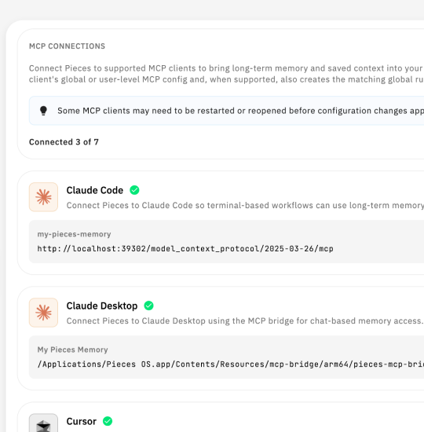
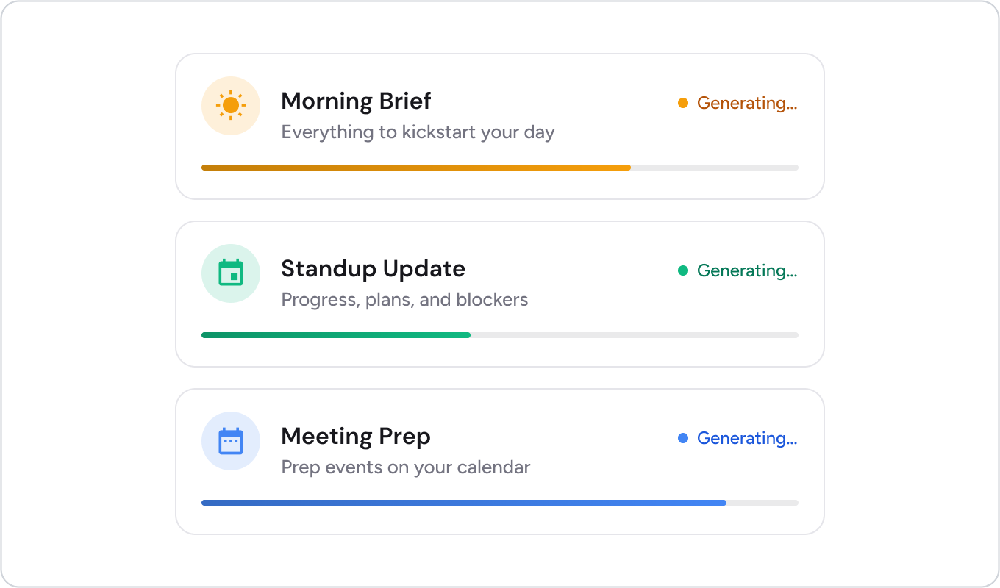
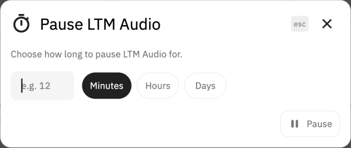

# What's new in Pieces 6.1.0

**Release date:** July 29, 2026
**Pieces Desktop:** 6.1.0

Pieces 6.0.0 changed how the agent reasons across your memory. Pieces 6.1.0 improves the source material behind that reasoning. Summaries now use open-file signals and browser activity, while the people, tags, and anchors they mention appear as live references instead of plain text. This extends the grounding introduced with Google Calendar in 6.0.0 to more of your workstream.

The release also removes several points of friction. Pieces provides managed MCP setup for seven clients shown in Settings, while OpenClaw links to setup documentation. Claude Desktop no longer needs Node.js, npx, or a separate bridge installation. Single-click summaries can run concurrently, Long-Term Memory can pause for a custom duration, and capture uses fewer resources when your computer is idle or locked.

---

## 🔗 MCP setup for the agents you already use

<picture>
  <source media="(prefers-color-scheme: dark)" srcset="../assets/6_1_0_claude_desktop_mcp_setup_dark.png">
  
</picture>

The **Settings → MCP** page is the central place to connect Pieces to the agents you use every day. Pieces 6.1.0 presents eight clients and provides managed setup for seven of them.

| Client | How Pieces connects it |
|--------|-------------------------|
| Claude Code | Managed Streamable HTTP connection, plus a Pieces skill |
| Claude Desktop | Managed stdio connection through the bundled Pieces MCP bridge |
| Cursor | Managed Streamable HTTP connection, plus a Pieces rule |
| GitHub Copilot in VS Code | Managed connection through the VS Code user-profile `mcp.json` |
| Codex CLI and IDE extension | Managed connection through the shared Codex configuration |
| Google Gemini CLI | Managed connection through Gemini's settings file |
| Antigravity | Managed connection through its Gemini configuration directory |
| OpenClaw | Setup documentation from the MCP catalog |

Available clients appear first. If a client is not installed or cannot be detected, Pieces keeps it in the catalog but hides the connect action until it becomes available.

### Claude Desktop no longer needs Node.js or npx

The MCP catalog and one-click setup arrived in Pieces 6.0.0. In 6.1.0, Claude Desktop's setup no longer depends on Node.js, npx, or `mcp-remote`.

Claude Desktop is different from HTTP-native clients such as Cursor, Claude Code, Codex, and Gemini CLI. It communicates over stdio, so earlier versions of Pieces relied on Node.js, npx, and `mcp-remote` to bridge Claude Desktop to PiecesOS.

PiecesOS now bundles `pieces-mcp-bridge`, and the desktop app writes the correct Claude Desktop configuration automatically. You no longer need to install Node.js, run npx, install `mcp-remote`, or edit Claude's JSON configuration by hand.

The setup also handles the details around the connection:

- On macOS and Windows, Pieces can tell you when Claude Desktop needs to restart and relaunch it for you.
- On Linux, where Claude Desktop has no official build, Pieces checks its Electron lock files and, when it appears to be running, guides you through quitting and reopening it manually. Automatic relaunch is not available.
- PiecesOS installations distributed through Snap or Flatpak resolve the bundled bridge through stable, host-visible paths.
- The bridge is signed as part of the macOS package and Authenticode-signed for Windows releases.

Keep PiecesOS running while you connect Claude Desktop so the desktop app can locate and validate the bundled bridge. Then open **Settings → MCP**, choose **Claude Desktop**, and connect it.

---

## 🗂️ Ground summaries in open files and browser activity

Pieces now uses the files open during a summary's time window and your browser activity as source context. Earlier versions inferred much of this from screen captures and focus events.

The open-file signal includes files that your operating system never marked as recently used.

Browser activity now contributes directly to the same summary context. When a summary references a source file, the citation is clickable, so you can move from the summary back to the artifact without searching for it again.

This follows the approach introduced with Google Calendar in 6.0.0. Pieces reads from the underlying source instead of reconstructing the entire activity from visual evidence. The result is a summary tied to the files and sites involved in the work it describes.

---

## 👤 See person context from a summary

Pieces detects people mentioned across your workstream and makes their names hoverable in summaries. Hovering a name opens a persona card with the person's identity, contact information, role, and an evolving picture of how you work together.

The relationship context comes from your interactions over time rather than a static contact record. Tags and anchors also appear as live references, so the entities in a summary can carry context of their own.

This helps when you need to place someone you met once, review an attendee before a meeting without leaving the page, or return to the last decision you made with a teammate.

Pieces 6.0.0 improved how the product distinguishes people. Pieces 6.1.0 exposes that understanding inside summaries, briefs, and chats.

---

## 🔀 Run several single-click summaries at once

<picture>
  <source media="(prefers-color-scheme: dark)" srcset="../assets/6_1_0_parallel_single_click_summaries_dark.png">
  
</picture>

Single-click summaries can now run concurrently. You can start a **Day Recap**, **Standup Update**, and **Meeting Prep** without waiting for each one to finish.

Rows showing generation progress update without rebuilding the entire timeline. Scrolling and reading remain responsive while several summaries are running.

---

## ⏸️ Pause Long-Term Memory for a custom duration

<picture>
  <source media="(prefers-color-scheme: dark)" srcset="../assets/6_1_0_custom_duration_ltm_pause_dark.png">
  
</picture>

You can now pause **LTM-2.7** and **LTM Audio** for a custom number of minutes, hours, or days instead of choosing only from presets.

Pieces displays a clear "Paused until" label with the time capture will resume. This makes it easier to pause for a confidential call, personal browsing, or time away without leaving capture disabled indefinitely.

The custom duration complements the existing controls for captured data and allowed applications by adding control over when capture runs. Set it from the user popover or **Settings → Long-Term Memory**.

---

## 🔋 Use fewer resources when you step away

Memory capture now performs less work across several parts of the pipeline:

- Change detection runs against a smaller frame.
- macOS captures at nominal resolution instead of full Retina resolution.
- Windows uses an event-driven wait instead of constant polling.
- Audio transcription workers share one model instead of loading a separate copy for each worker.

Capture also responds to whether you are present. It stops when the screen is locked and progressively lowers its sampling rate when the computer is idle.

Together, these changes reduce CPU, memory, and battery use while avoiding capture noise from periods when you are away from the computer.

---

## Try Pieces 6.1.0

1. If Claude Desktop did not connect before, go to **Settings → MCP** and reconnect it.
2. Connect another agent you use, such as Cursor, Claude Code, Codex, or Gemini CLI.
3. Generate a **Day Recap**, find a cited file, and open it from the summary.
4. Open a recent summary and hover a person's name to view the persona card.
5. Start a **Standup Update** while a **Day Recap** is still running.
6. Pause Long-Term Memory for a specific duration and confirm the "Paused until" time.

---

## What's next

- Cross-device real-time sync to keep memories, conversations, and settings current across your devices
- Shared Artificial Memories so teammates can use captured context together
- Outlook Calendar integration for calendar-aware context from Microsoft Outlook

---

## Learn more

- [Pieces Documentation](https://docs.pieces.app/): Guides, references, and how-tos for the Pieces platform
- [What's New in Pieces 6.0.0](./Whats%20New%20in%20Pieces%206.0.0.md): Agentic LTM, Meeting Prep, Google Calendar, and Reflection Mode
- [Pieces MCP and LTM Tools Reference](../guides/MCP/Pieces%20MCP%20and%20LTM%20Tools%20Reference.md): Reference for the tools exposed by the Pieces MCP server
- [All Pieces release notes](https://github.com/pieces-app/pro_tips/tree/main/releases)

---

<table width="100%"><tr>
<td>&nbsp;&nbsp;<a href="./Whats%20New%20in%20Pieces%206.0.0.md">← Previous: What's New in Pieces 6.0.0</a>&nbsp;&nbsp;</td>
</tr></table>
