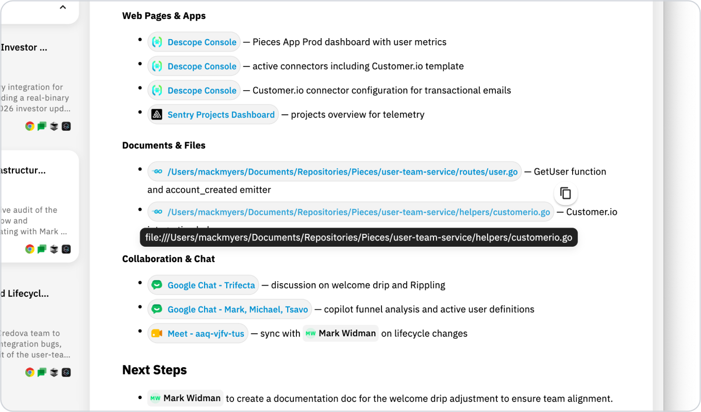
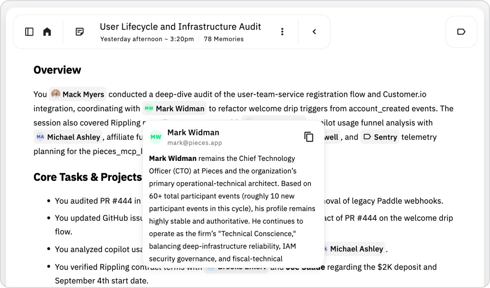
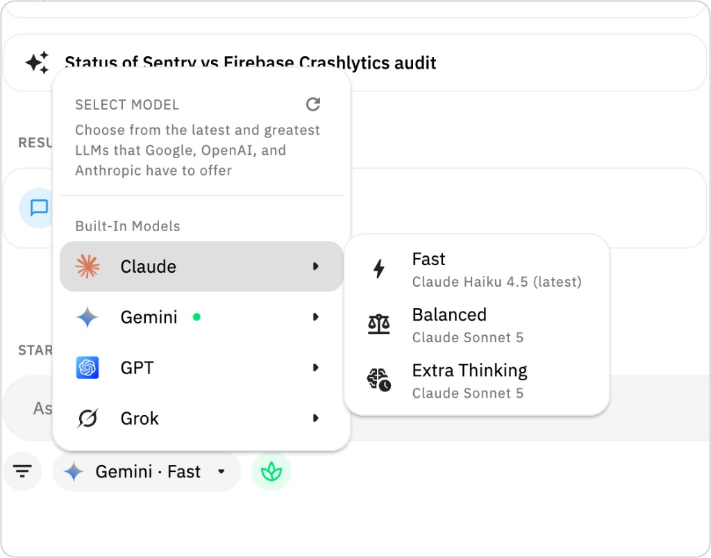
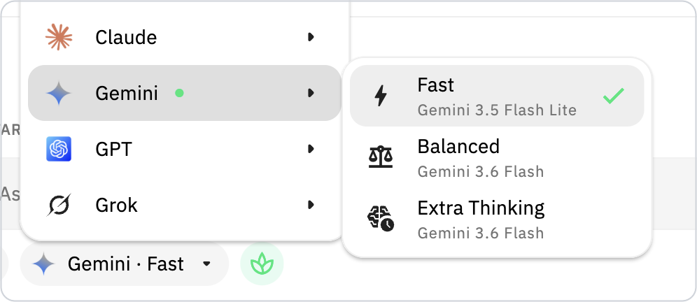
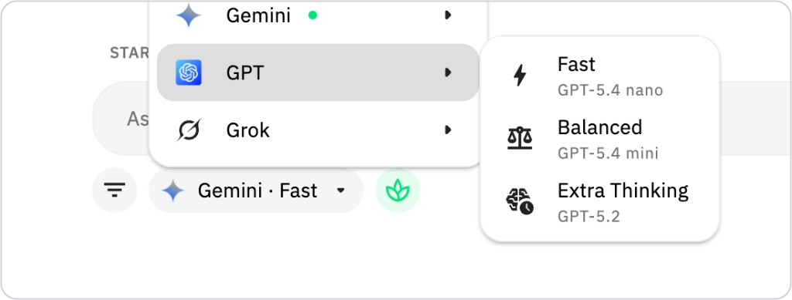
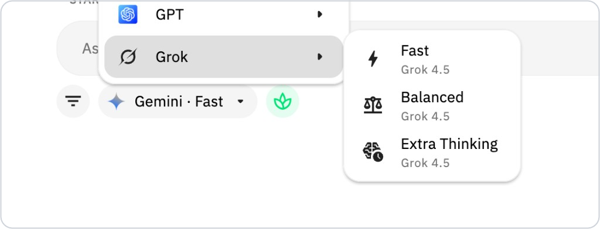

# Pieces Desktop 6.1.0: Claude Desktop MCP, Grounded Summaries & Person Intelligence
### Release Date: July 29, 2026

**Want to read this in your browser or explore past releases?** [View all release notes on GitHub](https://github.com/pieces-app/pro_tips/tree/main/releases)

6.0.0 rebuilt how the agent reasons about your memory. 6.1.0 is about what that reasoning is standing on.

Two themes run through this release. The first is **grounding** — summaries now read the real signals instead of interpreting a noisy picture of your day. The actual files you had open. Your actual browsing activity. The real people you interact with, as live references rather than plain text. It is the same idea behind connecting your calendar in 6.0.0, applied to the rest of your workstream.

The second is **getting out of your way**. Claude Desktop finally connects without a Node.js prerequisite. Single-click summaries run in parallel instead of queuing. You can pause Long-Term Memory for any duration you like. And capture itself got meaningfully lighter, with Pieces backing off when you are not at your desk.

Here is what is new.

---

## 🔗 Connect Claude Desktop Without Installing Anything

<picture>
  <source media="(prefers-color-scheme: dark)" srcset="../assets/6_1_0_claude_desktop_mcp_setup_dark.png">
  
</picture>

Connecting Claude Desktop to Pieces no longer requires installing anything.

Unlike editors that connect over HTTP, Claude Desktop talks to Pieces through a **stdio bridge** — and until now that bridge needed Node.js and npx on your machine, which is exactly where most setups fell apart. Pieces now ships that bridge itself, **code-signed**, on macOS, Windows, and Linux. Pick Claude Desktop, click connect, and Pieces writes the config for you.

### What is better

- **No Node.js or npx prerequisite** — the bridge comes bundled with Pieces
- A clear prompt when Claude Desktop needs to restart to pick up the change, with a button that does it for you
- On **Linux**, Pieces now notices Claude Desktop is already running and walks you through quitting first, instead of silently writing a config Claude would immediately overwrite
- **Snap and Flatpak** installs work — sandboxed bridge paths finally resolve correctly

### Why it matters

One-click MCP setup shipped in 6.0.0, but Claude Desktop was the client most likely to leave you hand-editing JSON anyway. If it is the one client you could never quite get connected, this is the release that fixes it.

Head to **Settings → MCP** to connect.

---

## 🗂️ Summaries Grounded in the Files and Sites You Actually Used

<picture>
  <source media="(prefers-color-scheme: dark)" srcset="../assets/6_1_0_summaries_grounded_in_files_and_browsing_dark.png">
  
</picture>

Your summaries now know **which files you actually had open** and **which sites you actually visited**.

Previously Pieces inferred a lot of this from what happened to be on screen. Now it reads the real signals: the files you had open during the window being summarized — including ones your OS never registered as "recently used" — and your actual browsing activity, instead of guessing from focus events.

### What is new

- Real open-file signals, not focus-event approximations
- Actual browsing activity feeding summary context
- **Files cited in a summary are clickable** — jump straight from "here is what you worked on" to the thing you worked on

### Why it matters

It is the same idea behind connecting your calendar: stop interpreting a noisy picture of your day and read from the source instead. The result is summaries that point at real artifacts you can open, not approximations of them.

---

## 👤 Hover Anyone in a Summary to See Who They Are

<picture>
  <source media="(prefers-color-scheme: dark)" srcset="../assets/6_1_0_inline_person_intelligence_dark.png">
  
</picture>

The people in your summaries are now **people you can actually learn about**.

Pieces detects who gets mentioned across your workstream and turns each one into a rich, hoverable reference. Hover any name in a summary and you will get a **persona card** — who they are, how to reach them, their role, and a running picture of how you two actually work together, built from your real interactions over time rather than a static contact record.

Tags and anchors work the same way, so the entities in your summaries are live references instead of plain text.

### When it helps

- A summary mentions someone you have met once and cannot quite place
- You are walking into a meeting and want context on an attendee without leaving the page
- You need to recall what you and a teammate last decided together

### Why it matters

6.0.0 improved how well Pieces tells people apart. This release puts that understanding somewhere you can actually use it. The better Pieces understands who is who, the more useful every summary, brief, and chat built on top of that becomes.

---

## 🔀 Run Several Single-Click Summaries at Once

<picture>
  <source media="(prefers-color-scheme: dark)" srcset="../assets/6_1_0_parallel_single_click_summaries_dark.png">
  
</picture>

Single-click summaries no longer wait in line.

You can now run several at once instead of waiting for each one to finish before kicking off the next. Start a **Day Recap**, a **Standup Update**, and a **Meeting Prep** together and let them generate side by side.

The timeline stays smooth while they work, too — generating rows no longer force the whole list to rebuild, so scrolling and reading stay responsive even with several summaries in flight.

---

## ⏸️ Pause Long-Term Memory for Exactly as Long as You Want

<picture>
  <source media="(prefers-color-scheme: dark)" srcset="../assets/6_1_0_custom_duration_ltm_pause_dark.png">
  
</picture>

Pausing Long-Term Memory is no longer limited to the presets.

You can now pause **LTM-2.7 and LTM Audio for any duration you like** — minutes, hours, or days — and Pieces shows a clear "Paused until" label so you always know exactly when capture picks back up. No more pausing indefinitely and forgetting, or wondering whether you are still paused.

Handy for a confidential call, a stretch of personal browsing, or a few days off.

### Why it matters

This rounds out your memory controls. You could already manage what Pieces has captured and which apps it is allowed to see — now you control exactly **when** it is paying attention.

Available from the user popover, or **Settings → Long-Term Memory**.

---

## 🔋 Lighter on Your Battery, and Paused When You Step Away

Pieces got noticeably lighter on your machine — and it now knows when to stop watching.

Memory capture went through a real efficiency pass. Change detection runs against a much smaller frame, macOS captures at nominal instead of full Retina resolution, and Windows moved to an **event-driven wait instead of constant polling**. Audio transcription now shares a single model across workers rather than loading a separate copy for each one.

Just as importantly, capture now pays attention to whether you are actually there. When your **screen is locked**, Pieces stops capturing entirely. When you go **idle**, it backs off progressively instead of sampling at full rate — so an unattended laptop is not burning battery recording a screen nobody is looking at.

Less CPU, less memory, longer battery, and less captured noise from moments you were not even at your desk.

---

## 🏗️ More Durable Real-Time Account and Organization Sync

Pieces Desktop 6.1.0 pairs with **PiecesOS 12.6.0**, which introduces a more durable path for account and organization state to move from the User/Team Portal and backend services into running clients.

PiecesOS 12.6.0 now receives reflected user data, organization membership, subscription state, and migration-offer state through authenticated Firestore listeners. Organization reads are scoped to the signed-in user's memberships; other account streams listen to user-specific documents. On reconnect, PiecesOS receives current snapshots and explicitly reconciles organization membership, removing organizations left while the client was offline.

The backend reflection service adds a durable outbox, per-document ordering, retries, deletion recovery, bounded delivery concurrency, and scheduled reconciliation jobs. Separately, User/Team Portal reconnect handling refreshes authentication and refetches organization membership.

### Infrastructure for What Comes Next

This establishes a reusable transport for future account and organization controls. Fleet presence and client-version inventory, scheduled team or organization reports, working-hours administration, and broader policy controls are separate future work and are not included in Pieces Desktop 6.1.0 or PiecesOS 12.6.0.

---

## ⚙️ PiecesOS 12.6.0: Better Formation, Search, and Recovery

### Better-Grounded Summary Formation

Workstream Summary formation now defaults to a two-call multipass pipeline. A fast structured pass produces the title, description, tags, hints, and outline; a second pass writes prose grounded in selected events and validated person and website evidence.

This replaces roughly five sequential model calls with two and adds deterministic validation for links and person references.

### Time-Based Recall Before a Summary Exists

Temporal searches can now find relevant Workstream Events before those events have been folded into a Workstream Summary. Questions such as "what happened between 7 and 8?" no longer depend on the summary roll-up having completed first.

Direct temporal phrases are also parsed more reliably, giving memory search a clearer window before retrieval begins.

### MCP Sessions Recover More Safely

The bundled MCP bridge can launch PiecesOS when it is unavailable, replay the MCP `initialize` handshake after reconnecting to a restarted PiecesOS, and return retryable errors for interrupted calls without replaying potentially side-effecting requests. Windows App Execution Alias handling and Flatpak bridge paths were also hardened.

### Stronger Capture-Time Privacy

For vision capture, website restrictions now prefer the URL captured with the same frame. If that URL is unavailable, Pieces uses focus history from the capture window and fails closed when the matching page is organization-blocked.

---

## 🤖 Live Model Routes and Smarter Agent Planning

Agentic Chat groups the built-in Claude, Gemini, GPT, and Grok options into **Fast**, **Balanced**, and **Extra Thinking** picker tiers. PiecesOS reads OpenRouter's live model listing, enriches it with catalog metadata, and applies compatibility and tier-selection rules. Compatible models can therefore move into these slots without another Desktop release, but the displayed names are runtime selections, not a roster pinned to 6.1.0.

  
  

  
  

In the runtime captured for these screenshots, the picker displayed:

| Provider | Fast | Balanced | Extra Thinking |
|----------|------|----------|----------------|
| Claude | **Claude Haiku 4.5 (latest)** | **Claude Sonnet 5** | **Claude Sonnet 5** |
| Gemini | **Gemini 3.5 Flash Lite** | **Gemini 3.6 Flash** | **Gemini 3.6 Flash** |
| GPT | **GPT-5.4 nano** | **GPT-5.4 mini** | **GPT-5.2** |
| Grok | **Grok 4.5** | **Grok 4.5** | **Grok 4.5** |

These selections can change as PiecesOS refreshes its cached catalog and as model availability, credentials, validation results, and fallback behavior change. "Live" does not mean OpenRouter assigns the tiers or that every menu open performs a fresh catalog request; Pieces selects each tier from its current runtime inventory.

### Planning Before the First Response

Before the first worker response, RouteAdvisor runs a planning pass that selects and orders a task-specific tool set. PiecesOS normally resolves the planner through the system's accurate-tier model, independently of the conversation model selected in the picker. If that separate lookup fails, the released configuration can fall back to runtime model slots that may carry the selected conversation model.

Core memory, time, persona, and filesystem tools remain pinned into every plan while RouteAdvisor curates the larger catalog. Under a healthy plan, unselected tools are hidden. For recoverable planner failures handled by the configured fallback, Pieces exposes the full registered catalog for one worker completion; unrecoverable dispatch errors can still terminate before the first worker response.

### Scenario-Aware Evaluation for Memory Questions

The agent's evaluation layer now distinguishes temporal recall, entity lookup, contextual topic search, multi-source questions, and questions where a negative answer may be correct. It uses that classification to judge whether the worker retrieved enough evidence without pushing it to fabricate results when memory is genuinely empty.

The model inventory also keeps coding, safety, OCR, embedding, speech, image, video, and other specialized models out of general text-chat slots. OpenRouter empty completions are retried instead of becoming silent blank turns. Separately, pure-LLM calls encountering a deprecated model prefer a same-provider, same-tier replacement before widening to another provider in the same tier.

---

## Getting Started with 6.1.0

1. **Reconnect Claude Desktop** — head to Settings → MCP and connect it, especially if you gave up on it before
2. **Generate a Day Recap** — look for the cited files and click straight through to one
3. **Hover a name** — open any recent summary and hover someone mentioned in it to see their persona card
4. **Kick off two summaries at once** — start a Standup Update without waiting for your Day Recap to finish
5. **Try a custom pause** — pause Long-Term Memory for a specific stretch from the user popover and watch for the "Paused until" label

---

## What is Next

- **Cross-Device Real-Time Sync** — seamless sync so your memories, conversations, and settings are current wherever you work
- **Shared Artificial Memories** — share Long-Term Memories with teammates so captured context benefits the whole team
- **Outlook Calendar Integration** — the same calendar-aware intelligence for Microsoft Outlook users

Thanks for being part of the Pieces community.

---

## Learn More

- **[Pieces Documentation](https://docs.pieces.app/)** — Guides, references, and how-tos across the entire Pieces platform
- **[What's New in Pieces 6.0.0](https://github.com/pieces-app/pro_tips/blob/main/releases/Whats%20New%20in%20Pieces%206.0.0.md)** — Agentic LTM, Meeting Prep, Google Calendar, and Reflection Mode
- **[Pieces MCP and LTM Tools Reference](https://github.com/pieces-app/pro_tips/blob/main/guides/MCP/Pieces%20MCP%20and%20LTM%20Tools%20Reference.md)** — Full reference for every MCP tool the Pieces server exposes
